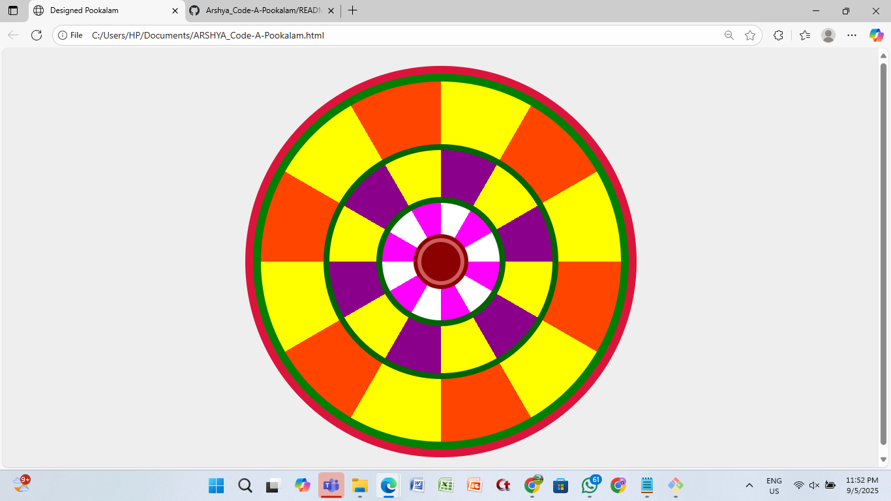

# Code-A-Pookalam 🌸
Welcome to CODE-A-പൂക്കളം, a creative coding challenge scheduled from September 1–6, where tradition meets technology! 🌼

### Your Details
- [Arshya D Prem] - [ERE] - [S1]

### Hosted Pookalam Link
ARSHYA_Code-A-Pookalam.html

### Pookalam Description
Athappookkalam is symbolic of prosperity and joy. Starting from the day of Atham, Pookkalams are created in Malayali households across the state. It is believed that these pookkalams are made to welcome Mahabali. In earlier times, only locally available flowers were used to create Pookkalams. Pookkalam is laid on the front yard. On the first day of Atham, a simple pookkalam is made using ‘thumba’ flower. On the day of Chithira, white flowers are laid. The size of the Pookkalam will keep increasing with each passing day. Yellow flowers like ‘Mukkutti’ and ‘Kolambi’ are also sometimes laid on the first day. It is believed that from the day of Chothi, bright flowers like hibiscus can be laid on the pookalam. On the day of Moolam, the Pookkalam will be square-shaped and will be known as ‘Moolakkalam’.

### Technologies Used 
HTML & CSS 

### Video explaining How you build the pookalam
<video controls src="Video.mp4" title="Title"></video>

### Screenshots

Happy Onam !  
Made with ❤️ at TinkerHub LBSITW

